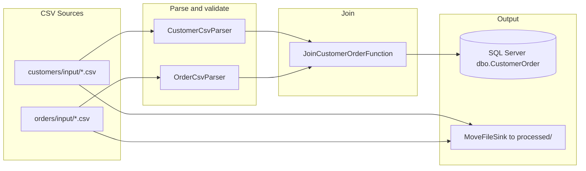

# flink-csv-mssql

Apache Flink streaming job that reads **Customer** and **Order** CSV files from watched folders, joins them by `customerId`, and writes the result to **Microsoft SQL Server**.

## Tech stack

| Layer | Technology |
|---|---|
| Language | Java 11 |
| Stream processing | Apache Flink 1.19.x |
| File source | Flink File Source (`flink-connector-files`) |
| Database sink | Flink JDBC Connector + SQL Server JDBC |
| Database | Microsoft SQL Server |
| Build | Maven |
| Logging | SLF4J + Log4j2 |

## Process flow



### Step-by-step

1. **Load config** — `Application` loads `flink-{env}.properties` via `GlobalConfig` (`flink.env` system property, default: `uat`).
2. **Setup Flink** — parallelism, checkpointing (exactly-once), checkpoint storage, streaming mode.
3. **Read CSV folders** — `CsvFolder` watches `{csv.path}/input/` every 10 seconds for new `.csv` files.
4. **Filter headers** — header rows are skipped using robust matching (BOM, trim, case-insensitive first column).
5. **Parse rows** — `CustomerCsvParser` / `OrderCsvParser` parse CSV safely; bad rows are logged and skipped.
6. **Archive files** — `MoveFileSink` moves processed CSV files to `{csv.path}/processed/`.
7. **Join streams** — `JoinCustomerOrderFunction` connects customer and order streams keyed by `customer.id` / `order.customerId`.
8. **Write to SQL Server** — `CustomerOrderSink` batch-inserts joined records into `dbo.CustomerOrder`.

## Project structure

```
src/main/java/com/sahuri/flink/
├── Application.java              # Job entry point
├── GlobalConfig.java             # Properties loader
├── pojo/
│   ├── Customer.java
│   ├── Order.java
│   └── CustomerOrder.java
├── source/
│   ├── CsvFolder.java            # File source + pipeline wiring
│   ├── CsvLine.java              # CSV splitter (quotes, escaped quotes)
│   ├── CsvHeader.java            # Header detection (BOM, trim, case-insensitive)
│   ├── CsvParseMetrics.java      # Flink metrics for skipped/parsed rows
│   ├── CustomerCsvParser.java
│   ├── OrderCsvParser.java
│   └── MoveFileSink.java         # Moves CSV files to processed/
├── process/
│   └── JoinCustomerOrderFunction.java  # Keyed join with Flink state + TTL
└── sink/sqlserver/
    └── CustomerOrderSink.java    # JDBC sink to SQL Server
```

## Folder layout for CSV input

Place CSV files under the `input` subfolder. After processing, files are moved to `processed`.

```
C:/data/customers/
├── input/
│   └── customers.csv
└── processed/
    └── customers.csv

C:/data/orders/
├── input/
│   └── orders.csv
└── processed/
    └── orders.csv
```

## CSV format

### customers.csv

```csv
id,name,city
1,John Doe,Jakarta
2,"Jane Doe","New York, NY"
```

### orders.csv

```csv
order_id,customer_id,amount
1001,1,150000.50
1002,2,275000
```

Parsing supports:
- quoted fields with commas
- escaped quotes (`""`)
- UTF-8 BOM on header line
- case-insensitive header matching (`ID`, `id`, `Id`)

## Configuration

Copy an example file and fill in your values:

```bash
cp src/main/resources/flink-dev.properties.example src/main/resources/flink-dev.properties
cp src/main/resources/flink-uat.properties.example src/main/resources/flink-uat.properties
```

| Key | Description |
|---|---|
| `env.parallelism` | Flink operator parallelism |
| `checkpoint.path` | Checkpoint storage path |
| `checkpoint.interval.ms` | Checkpoint interval |
| `batch.size` | JDBC batch size |
| `batch.interval.ms` | JDBC batch flush interval |
| `jdbc.url` | SQL Server JDBC URL |
| `jdbc.username` / `jdbc.password` | Database credentials |
| `csv.path.customers` | Base path for customer CSV folders |
| `csv.path.orders` | Base path for order CSV folders |

## SQL Server table

```sql
CREATE TABLE dbo.CustomerOrder (
    order_id      INT            NOT NULL,
    customer_id   INT            NOT NULL,
    customer_name NVARCHAR(255)  NOT NULL,
    city          NVARCHAR(255)  NOT NULL,
    amount        DECIMAL(18, 2) NOT NULL
);
```

## Metrics

Flink counters are exposed per record type (`customer`, `order`):

| Metric | Meaning |
|---|---|
| `rows_skipped_header` | Header rows filtered out |
| `rows_skipped_parse` | Malformed or unparseable data rows |
| `rows_parsed_ok` | Successfully parsed rows |

View them in the Flink Web UI under the operator metrics.

## Build

```bash
mvn -DskipTests package
```

Shaded JAR output:

```
target/flink-csv-mssql-1.0-SNAPSHOT-shaded.jar
```

## Run

### Local (dev)

```bash
java -Dflink.env=dev -jar target/flink-csv-mssql-1.0-SNAPSHOT-shaded.jar
```

### UAT (default)

```bash
java -jar target/flink-csv-mssql-1.0-SNAPSHOT-shaded.jar
```

Or submit to a Flink cluster:

```bash
flink run -Dflink.env=uat target/flink-csv-mssql-1.0-SNAPSHOT-shaded.jar
```

## Join behavior

`JoinCustomerOrderFunction` uses Flink **keyed state** (not in-memory maps) with a 6-hour TTL. When a customer and order with the same key arrive (in any order), one joined `CustomerOrder` record is emitted.

## License

Private project — adjust as needed.
